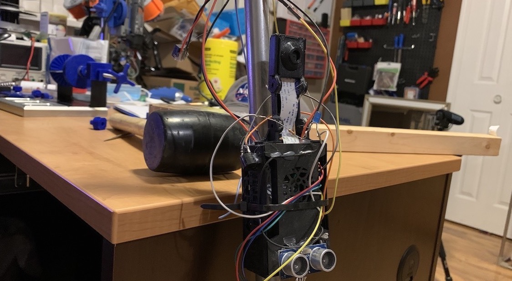

# Co-Pilot

Link to [Devpost](https://devpost.com/software/copilote) from the hackathon

## Inspiration
During a hackathon in early 2020, our team wanted to help the visually impaired using a pre-built machine with learning models offered by GCP's Cloud Vision API. With all the machine learning models pre-built it allowed us to quickly develop a system which will provide real time feedback to the user.

## What it does
The system we built captures the environment using a pi camera which then calls the Cloud Vision API to label the image. Using the labels from the image we are able to detect important information in the users surroundings. Examples include stop signs, crosswalks, and bus signs. Once the system detects these examples, the machine then feedbacks that information to the user in the form haptic shaking in the handle of walking stick and audio playback to the user.

## How I built it
We built it using the raspberry pi that is running a distribution of linux with our python code. From this raspberry pi we have attached a sonar sensor and pi camera to capture data in real time, that will then be sent to GCP's Cloud Vision API to return the labels. From these labels we compare them with important visual labels, such as a stop sign. This then activates the haptic feedback and audio feedback. The audio feedback will concatenate the label with a sentence that alerts the user of the sign. To convert the text to speech we call GCP's Text To Speech API, which we output through the users headphones.

## Challenges I ran into
The biggest challenges we ran into was what platform to build this product on. We initially were going to build it for android mobile, but we later pivoted to a more hardware based approach with the raspberry pi.

